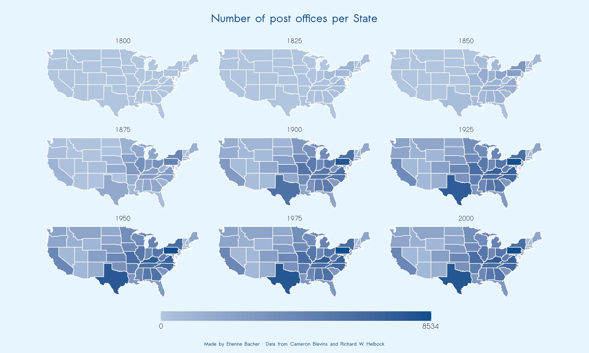
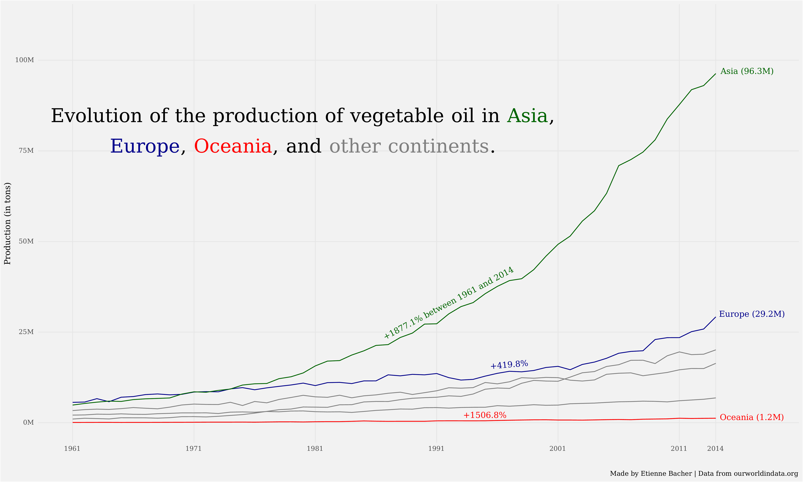
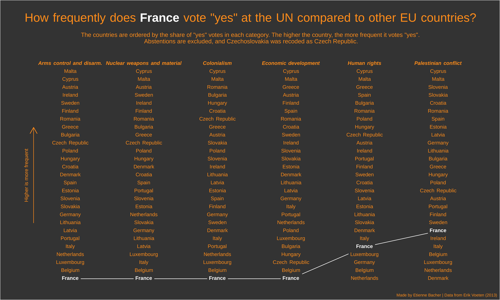
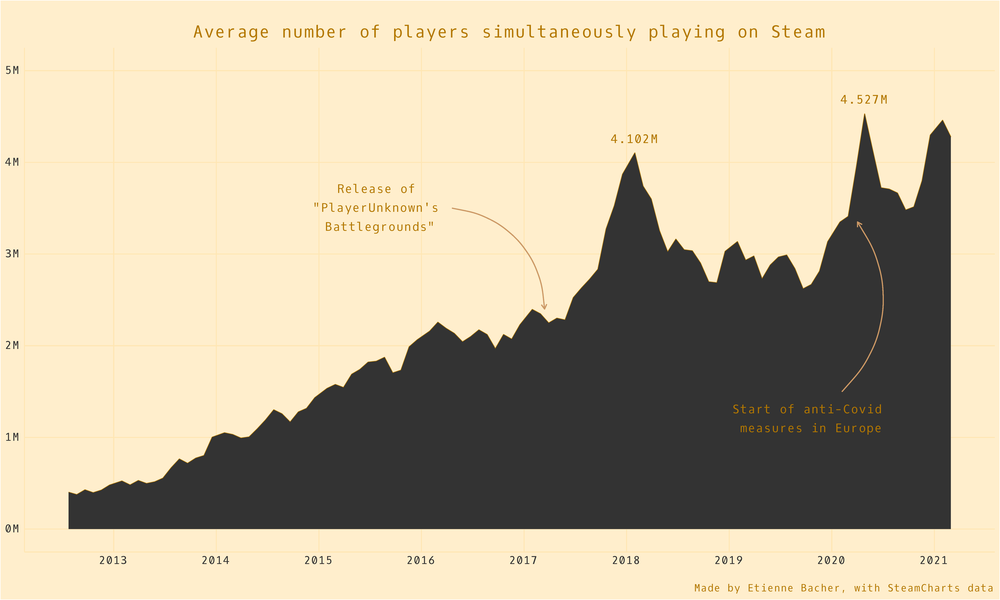
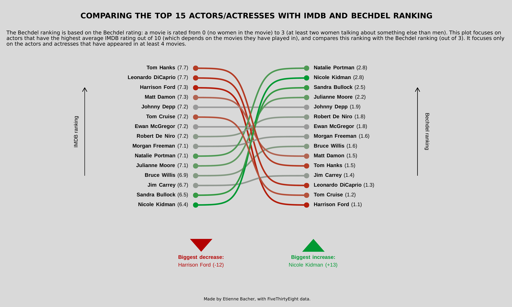
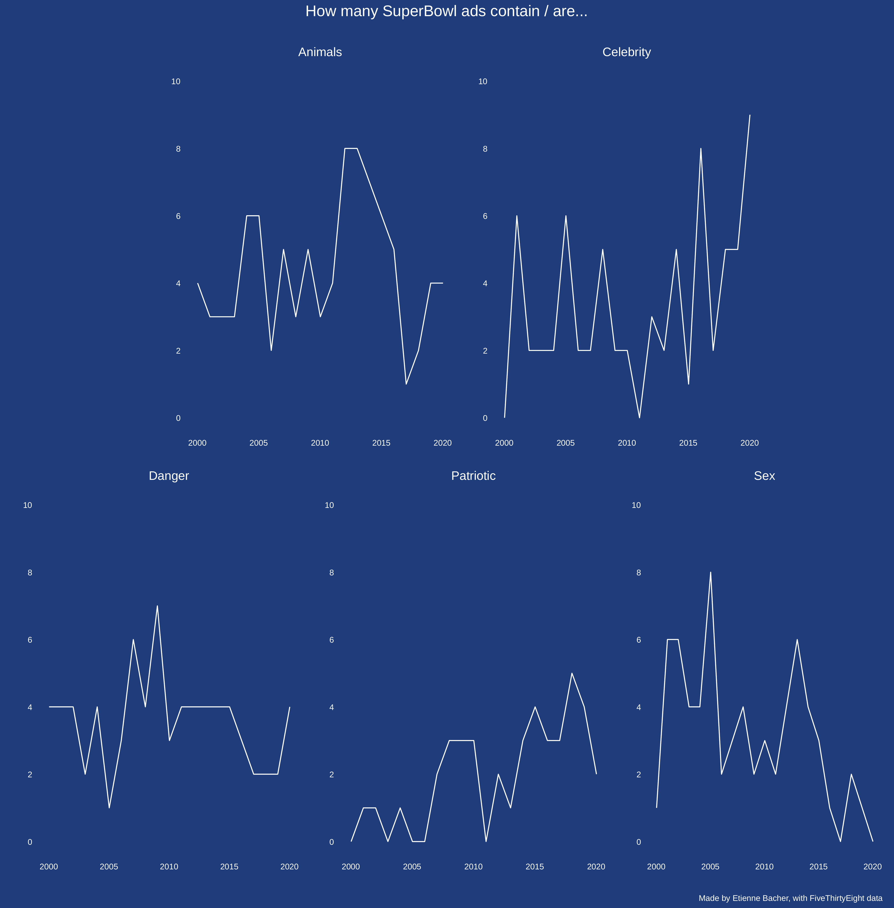
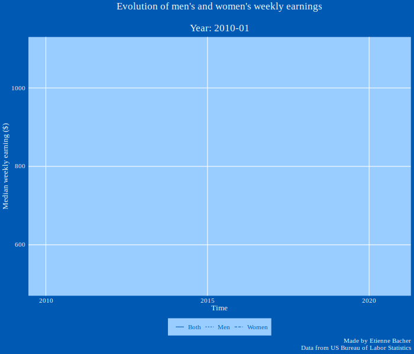

# My plots for TidyTuesday

## 2021, Week 16, US post offices

## 2021, Week 15, Deforestation

## 2021, Week 13, UN votes

## 2021, Week 12, Steam games

## 2021, Week 11, Bechdel test

## 2021, Week 10, SuperBowl ads

## 2021, Week 09, Employment status

## 2021, Week 08, Dubois challenge (see folder for original plot)

## 2021, Week 07, Home ownership in the US

## 2021, Week 05, Plastic pollution

